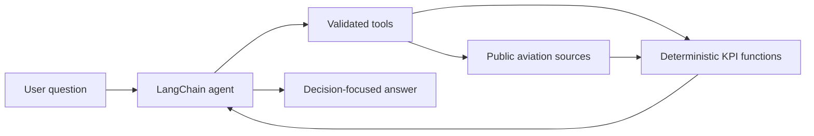

# Airport Investment Agent

## Overview

The Airport Investment Agent is a conversational screening tool for US airport
modernization opportunities. It combines public aviation data with deterministic
KPI calculations, then uses an LLM to choose the appropriate analysis and explain
the result.

The product is a first-pass research assistant. It can identify signals worth
investigating, such as strong passenger growth, airline seat pressure, or poor
arrival reliability. It does not forecast investment returns, measure latent
demand directly, or prove that an airport has reached its physical capacity.



The implementation uses one agent. Pydantic validates tool inputs, source
adapters retrieve and normalize data, and ordinary Python calculates every
number and ranking. BTS results are cached for 24 hours to reduce latency and
avoid repeated requests.

## Run

```sh
uv sync --locked
cp .env.example .env
uv run --env-file .env python -m airport_agent.cli
```

Set `OPENROUTER_API_KEY` in `.env`. OpenSky flight history also requires
`OPENSKY_CLIENT_ID` and `OPENSKY_CLIENT_SECRET`. The default model is
`openai/gpt-5.6-terra`; LangSmith tracing is optional.

Run the offline checks with `uv run python -m unittest discover`.

## Chosen data sources

The prototype uses free public sources that can be queried at runtime without a
pre-built aviation warehouse.

| Source | Used for | Why it was chosen | Main boundary |
| --- | --- | --- | --- |
| BTS T-100 airport summary | Monthly outbound passengers, seats, and departures | Official US traffic data with enough history for year-over-year comparisons | Aggregated service classes; no route detail or complete inbound totals |
| BTS Airline On-Time report | Arrival delays, cancellations, and reported causes | Official historical operating-performance data | Domestic arrivals from reporting carriers; HTML report rather than a JSON API |
| OpenSky | Observed arrivals, departures, and route inference | Free flight-level observations suitable for a prototype long-haul calculation | ADS-B coverage is incomplete and is not a schedule or passenger count |
| Aviation Weather Center | Airport identity, coordinates, runways, and current weather | Public, structured, and aviation-specific | Runway facts do not describe usable hourly capacity |
| FAA NAS Status | Current delays, closures, and traffic-management events | Authoritative live operating context | Current events cannot explain historical performance |

The sources are kept separate when their coverage differs. In particular, T-100
commercial traffic totals are not combined into a flight denominator with BTS
domestic arrival performance.

## Scoring methodology

The methodology keeps each signal visible. There is no opaque weighted score.
Every comparison uses an explicit period of no more than 12 months and, for
growth, the same months one year earlier.

### Growth screen

This screen ranks two or more airports by outbound passenger growth. Current
seat occupancy breaks a tie. It also reports absolute passenger change and both
periods' totals so that a high percentage from a small base is easy to spot.

- Passenger growth = `(current passengers / prior passengers - 1) × 100`
- Seat growth = `(current seats / prior seats - 1) × 100`
- Growth gap = `passenger growth - seat growth`, in percentage points
- Seat occupancy = `current passengers / current seats × 100`

An airport is excluded when the comparison period is incomplete or a required
baseline is zero. Ranking uses unrounded values, and exact ties share a rank.

### Congestion screen

This screen ranks airports by the share of reported domestic arrivals delayed
at least 15 minutes. Cancellation rate breaks a tie. Both rates use all reported
operations, including cancellations and diversions, as the denominator.

The result measures operational disruption. It does not measure runway, gate,
terminal, or peak-hour utilization, so the agent describes the first airport as
more disrupted rather than physically constrained.

### Demand-pressure proxy

Unmet demand is latent travel and cannot be counted from completed flights. The
agent therefore uses a narrower demand-pressure signal. It is positive only when:

1. passenger growth is positive; and
2. passenger growth exceeds seat growth.

Seat occupancy and domestic arrival disruption are shown as separate supporting
evidence. They are not multiplied together because T-100 traffic and BTS arrival
performance cover different flight populations. The output is explicitly called
a proxy and never presented as a count of passengers who could not travel.

### Two-airport modernization screen

For a direct comparison, each airport can win one vote in each of three visible
dimensions:

| Dimension | Deterministic rule |
| --- | --- |
| Growth momentum | Higher outbound passenger growth |
| Airline supply pressure | Positive growth and a positive growth gap are required; the higher gap wins, with occupancy as the tiebreaker |
| Operational pressure | Higher domestic arrival delay rate, with cancellation rate as the tiebreaker |

An airport needs at least two votes to lead. Equal dimensions cast no vote, and
the result can be `mixed evidence`. A leader is the stronger candidate for
further investigation under this screen, not a proven investment recommendation.

### Long-haul share

Long haul is defined as a route longer than 3,000 statute miles. The percentage
is confirmed long-haul outbound OpenSky observations divided by all outbound
observations for the same airport and UTC dates. Flights with unknown
destinations stay in the denominator, making the result a conservative lower
bound within an incomplete ADS-B sample.

## Key tradeoffs

**Transparency over a richer composite.** Equal votes and visible components are
easy to reproduce and explain. A weighted investment score or peer-group z-score
could appear more sophisticated, but the available prototype data do not justify
the weights or provide a complete peer universe.

**Live public access over perfect coverage.** The project avoids paid APIs and
bulk downloads. BTS T-100 provides monthly outbound commercial passengers,
seats, and departures; BTS On-Time provides domestic arrival reliability;
OpenSky provides observed routes; Aviation Weather Center and FAA provide airport
facts, weather, and current operating context. These sources have different
populations and cannot always be combined into one statistic.

**Observed pressure over physical capacity.** Growth, seat supply, and delays are
useful screening signals, but they do not establish a runway or terminal ceiling.
A stronger feasibility study would require peak-hour throughput, gates, runway
configuration, slot or curfew constraints, planned projects, capital cost, and
revenue evidence.

**Simple caching over a data platform.** A local SQLite cache improves speed and
resilience for a one-day prototype. It does not provide a historical warehouse,
shared cache, or formal data-versioning layer.

**A single agent over multi-agent orchestration.** The task mainly requires tool
selection and explanation. One tool-calling loop is easier to trace, test, and
debug, while deterministic functions carry the decision logic.

## Assumptions

- The scope is US airports identified by IATA code.
- An omitted comparison period defaults to the most recently completed calendar
  year versus the preceding year, and the answer discloses that choice.
- Passenger growth represents growth in served demand. It is evidence of market
  momentum, not a measurement of people who wanted to fly but could not.
- Available seats represent airline supply. They are not airport terminal, gate,
  or runway capacity.
- Domestic arrival delay rate is an operational-pressure proxy for congestion.
  It does not prove that airport infrastructure caused the delay.
- Long haul means a route distance greater than 3,000 statute miles. Unknown
  OpenSky destinations remain in the denominator, so the percentage is a lower
  bound within the observed sample.
- Reported source data are treated as comparable across the selected periods
  after required months and positive baselines are validated. A reported month
  does not guarantee that every carrier submission is complete.

## Constraints

This is a time-boxed home-assignment prototype built without paid data. Public
source coverage limits the conclusions: historical delay data exclude
international arrivals, OpenSky observations can be incomplete, and current FAA
or weather data cannot establish causes for past trends. The available sources
also lack gates, usable peak-hour throughput, slot and curfew constraints,
terminal crowding, project costs, and airport revenue forecasts.

The terminal interface, local SQLite cache, and single-process agent are suitable
for demonstration and evaluation. They are not designed for concurrent users,
long-term data retention, or production availability.

## Where and how AI is used

The LLM is the conversational coordinator. It:

- interprets the user's question and selects the relevant tool;
- applies disclosed defaults or asks one clarification when airport identity,
  airport set, metric, or period cannot be resolved safely;
- handles follow-up questions using conversation history; and
- turns structured evidence into a concise, decision-focused explanation with
  the period, source, assumptions, and material caveats.

The LLM does not calculate KPIs, invent missing values, or decide ranking rules.
Those responsibilities stay in typed Python functions. The system prompt requires
a tool call before any data-derived number and prevents internal tool workflow or
reasoning from appearing in the final answer.

This separation makes numeric results reproducible while retaining the useful
part of AI: understanding varied questions and explaining evidence in context.
LangSmith tracing records model calls and tool inputs and outputs during
development, and a tool-grounded evaluation suite checks both routing and answer
quality.

## Future improvements

The next improvement would be a physical-capacity layer: peak-hour operations,
gate utilization, runway configuration, slot or curfew rules, and planned capital
projects. This would test whether observed pressure is plausibly relieved by
modernization rather than merely correlated with it.

After that, the screen could add:

1. a complete airport peer universe and hub-class normalization;
2. a reliable route or schedule source for representative long-haul shares;
3. catchment demographics, competing airports, and surface-access indicators;
4. project cost, airline commitment, aeronautical revenue, and commercial revenue
   inputs for a financial screen; and
5. persistent versioned data, source monitoring, and broader human-reviewed
   evaluations for production use.

Until then, the agent should be used to shortlist airports and frame deeper
diligence, not to make a final investment decision.
